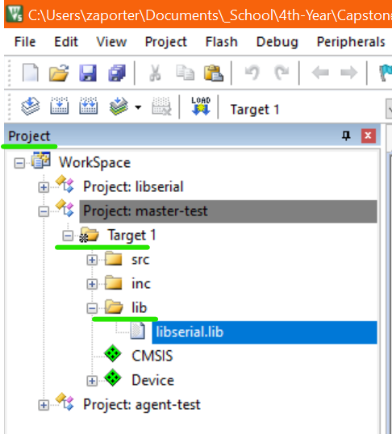

# Table of Contents

1.  [Purpose](#orgaabf47c)
2.  [Setup Instructions](#org0605a43)

# Purpose

This serial communication library, formerly Team 1&rsquo;s mini project, is intended to provide a easy to implement interface to interact with UART, I2C, and SPI devices.

# Setup Instructions

The setup instructions assume you have an existing project you wish to implement serial communication in.

1.  Clone this repository to your computer.
2.  Open the library project and build it.
3.  In your existing project, under &ldquo;*Options for Target 1 >> C/C++ (AC6) >> Include Paths*&rdquo; add the ralative path to the &ldquo;*libserial//inc*&rdquo; diretory

1.  In the project window at the left side of the Keil IDE, right click on the &ldquo;*Target 1*&rdquo; folder and add a new group.
2.  Rename this new group/folder to lib.
3.  right click on the &ldquo;*lib*&rdquo; folder, add existing item, and add the &ldquo;*libserial//Objects//libserial.lib*&rdquo;

In order to use this library in your code you will need to include the appropriate header files.

    #include <MKL25Z.h>
    
    // Include libserial headers
    #include "drivers/uart.h"
    #include "drivers/i2c.h"
    #include "drivers/spi.h"
    
    int main() {
    
      // Main code here
    
    }

